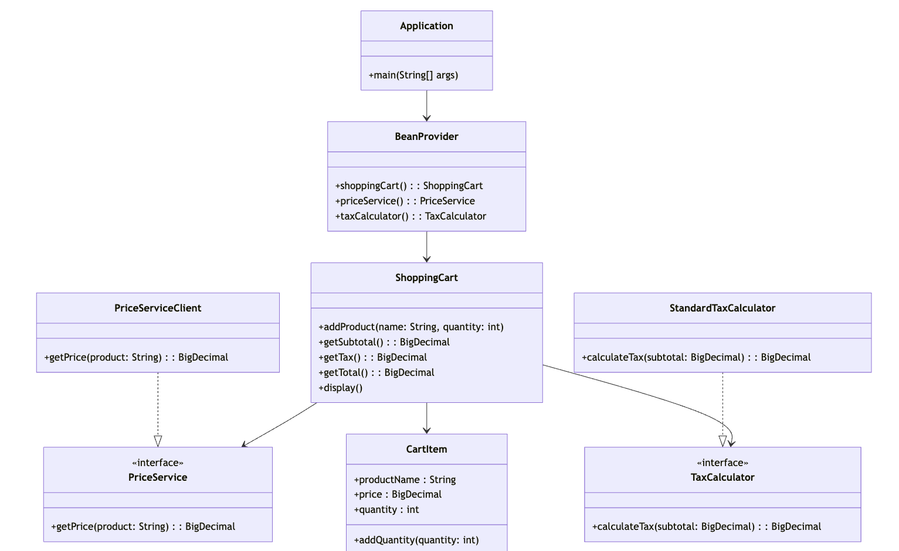

# Basic Shopping Cart Implementation

## Overview
This project implements a **Shopping Cart** that allows adding products, retrieving prices from an external API, calculating totals, and displaying cart contents. It follows **SOLID principles**, uses **GoF design patterns**, and adheres to clean coding best practices.

## Features
- **Add products** to the cart (with quantity and price retrieval from an API).
- **Retrieve product prices** from the Price API.
- **Calculate total cost**, including tax (12.5%).
- **Display cart contents** with a breakdown of subtotal, tax, and total payable.
- **Error handling** for API failures, invalid inputs, and edge cases.
- **Unit-tested** with mocks for API interactions.

## Class Diagram


## API Integration
The system fetches product prices from an external API:
- **Base URL:** `https://equalexperts.github.io/backend-take-home-test-data/`
- **Product Price Endpoint:** `GET /{product}.json`
- **Example Response:**
  ```json
  {
    "title": "Cheerios",
    "price": 8.43
  }
  ```

## Usage & Execution

### **1. Setting Up Dependencies**
Ensure you have **Java 17+** and **Maven** installed.

### **2. Running the Application**
```sh
mvn clean install
java -jar target/cart-1.0.0-SNAPSHOT-jar-with-dependencies.jar
```

### **3. Example Execution Output**
```
22:47:03.945 [main] INFO  net.rahuls.shopping.Application -- Created new Shopping cart
22:47:05.272 [main] INFO  n.rahuls.shopping.cart.ShoppingCart -- 2 x cornflakes @ 2.52 each
22:47:05.274 [main] INFO  n.rahuls.shopping.cart.ShoppingCart -- 1 x weetabix @ 9.98 each
22:47:05.275 [main] INFO  n.rahuls.shopping.cart.ShoppingCart -- Subtotal: 15.02
22:47:05.275 [main] INFO  n.rahuls.shopping.cart.ShoppingCart -- Tax: 1.88
22:47:05.275 [main] INFO  n.rahuls.shopping.cart.ShoppingCart -- Total: 16.90
```

## Unit Testing
Run unit tests with:
```sh
mvn test
```
Test cases cover:
- **Price API responses**
- **Cart calculations (subtotal, tax, total)**
- **Edge cases (zero/negative quantity, API failures, etc.)**

## Error Handling
The implementation gracefully handles:
- **Invalid product names** (returns a meaningful error).
- **API unavailability** (caches and fallback handling).
- **Negative or zero quantities** (throws validation errors).
